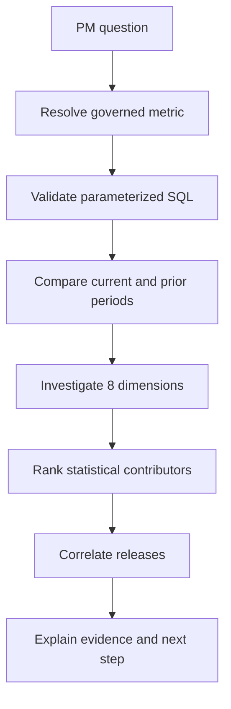

<div align="center">

# Autonomous Product Analyst

**Ask why a product metric changed. Get a governed investigation—not a guessed SQL answer.**

Evidence-first · Safe SQL · Multi-dimensional analysis · Local synthetic MVP · No paid API required

[](https://github.com/MadanMohan0537/autonomous-product-analyst/actions/workflows/ci.yml)

[](LICENSE)

</div>

## Reproduce an investigation before connecting your own data

Start with the synthetic dataset and a supported metric question from the examples below. Inspect the comparison windows, segment evidence and executed queries in the response before trusting the narrative.

The investigation identifies associations in the configured metric model. It does not establish causality or authorize unrestricted access to arbitrary databases. A read-only SQL boundary helps constrain execution; it does not determine whether a user's data access is appropriate.

For implementation review, use [API orchestration](backend/app/main.py), [data generation](scripts/generate_data.py), [tests](tests/) and [evaluation fixtures](evaluation/). Preserve the database snapshot and question with each report.


Autonomous Product Analyst investigates product-performance changes without requiring a PM to manually write and run a sequence of SQL queries. It resolves a question to a governed metric, compares time periods, checks eight diagnostic dimensions, ranks contributors, quantifies statistical evidence, relates the timing to product releases, and produces a PM-ready explanation with a concrete next step.

This is intentionally stronger—and safer—than a basic text-to-SQL demo. The system does not ask a language model to invent metric definitions or root causes. Its analytical result is deterministic, testable, and traceable; an optional future LLM may narrate computed facts but never become their source.

## Example

**Question**

> Why did activation fall last week?

**Answer from the bundled synthetic dataset**

> Activation fell 7.0 percentage points, from 73.2% to 66.2%.
>
> The largest measured contributor was Android, which fell 25.0 points and represented 359 current-period users. Release 4.18 occurred in the comparison window and introduced a payment-permission step for Android onboarding.
>
> Recommended investigation: reproduce the Android onboarding journey around release 4.18.

The result is labeled as a ranked statistical association—not proof that the release caused the regression.

## What makes this autonomous

A normal text-to-SQL tool generates one query. This engine runs a structured investigation:



For every question, the MVP checks:

| Dimension | Example values |
|---|---|
| Platform | iOS, Android, web |
| Country | US, UK, India, Germany |
| User segment | Self-serve, SMB, enterprise |
| Acquisition source | Organic, paid search, partner, referral |
| App version | 4.17, 4.18 |
| Device | Phone, tablet, desktop |
| Feature usage | Templates, import, payment-permission |
| Onboarding step | Account created, workspace created |

## At a glance

| | |
|---|---|
| **Users** | Product managers, product analysts, growth teams, and founders |
| **Governed metrics** | Activation, conversion, and retention |
| **MVP data** | Deterministic synthetic SaaS product events in SQLite |
| **Analysis** | Period comparison, dimension cuts, contribution ranking, pooled two-proportion z-score, release context |
| **Interface** | FastAPI JSON API and responsive system-aware light/dark dashboard |
| **Cost posture** | Entire working path uses free, open-source software and no model API |

## Implemented now

- Version-controlled metric registry with explicit numerator and denominator events
- Natural-language metric resolution for supported questions
- Parameterized SQL generation from allowlisted identifiers
- Read-only SQL guard that rejects mutation, comments, multiple statements, and unknown tables
- SQLite query-only execution and bounded result sets
- Automated current-versus-previous period analysis
- Eight-dimension root-cause hypothesis search
- Contributor ranking by rate change and affected population share
- Two-proportion z-score for strength-of-evidence context
- Release-window correlation and causality guardrail
- Deterministic PM explanation and recommended investigation
- Synthetic generator with a planted Android activation regression in release 4.18
- Responsive light/dark web interface
- FastAPI boundary, Dockerfile, Docker Compose, CI, tests, and evaluation
- PRD, architecture, product strategy, and metrics documentation

## Scope status

| Capability | Status | Boundary |
|---|---|---|
| Synthetic SaaS dataset | Implemented | 28 days, 3,360 users, approximately 8,500 events |
| Activation investigation | Implemented and evaluated | Planted Android regression is found |
| Conversion and retention | Implemented | Governed definitions; no planted incident claim |
| Safe SQL | Implemented | Fixed schema and table allowlist |
| Root-cause investigation | Implemented | One-dimensional associations across eight dimensions |
| FastAPI and dashboard | Implemented | Local or container deployment |
| DuckDB/PostgreSQL | Planned adapters | SQLite is the zero-dependency MVP baseline |
| Snowflake/BigQuery | Planned | Must use scoped read-only credentials and cost limits |
| Amplitude/Mixpanel | Planned | Export/API connectors are not represented as complete |
| LLM narration | Optional roadmap | Must remain downstream of computed evidence |
| Causal inference | Not implemented | Release timing and segment shifts are associations |

## Quick start

Requires Python 3.11 or newer.

```bash
git clone https://github.com/MadanMohan0537/autonomous-product-analyst.git
cd autonomous-product-analyst
python -m venv .venv
```

Activate the environment:

```bash
# macOS/Linux
source .venv/bin/activate

# Windows PowerShell
.venv\Scripts\Activate.ps1
```

Install, generate data, test, and run:

```bash
python -m pip install -r requirements.txt
python scripts/generate_data.py --output data/product_analytics.db --end 2026-09-01
python -m unittest discover -s tests -v
uvicorn backend.app.main:app --reload
```

Open `http://127.0.0.1:8000` and press **Investigate**.

### Docker

```bash
docker compose up --build
```

Open `http://localhost:8000`.

## API

### Health

```http
GET /api/health
```

### Investigate a question

```http
POST /api/analyze
Content-Type: application/json

{
  "question": "Why did activation fall last week?",
  "end": "2026-09-01",
  "window_days": 7
}
```

```bash
curl -X POST http://127.0.0.1:8000/api/analyze \
  -H 'Content-Type: application/json' \
  -d '{"question":"Why did activation fall last week?","end":"2026-09-01","window_days":7}'
```

The response contains the explanation and the full investigation trace: metric contract, periods, counts, rates, delta, z-score, every dimension checked, ranked contributors, release context, and the causality warning.

## Governed metric definitions

| Metric | Numerator | Denominator |
|---|---|---|
| Activation | Distinct users with `onboarding_completed` | Distinct users with `signup` |
| Conversion | Distinct users with `subscription_started` | Distinct users with `signup` |
| Retention | Distinct users with `retained` | Distinct users with `signup` |

Metric definitions live in [`backend/app/metrics.py`](backend/app/metrics.py). Changing a definition is a code-reviewed contract change, not a prompt tweak.

## SQL safety model

Generated analytical SQL is constrained before execution:

- Only one `SELECT` or `WITH` statement is accepted.
- Mutating and administrative keywords are rejected.
- SQL comments and multiple statements are rejected.
- Tables and dimensions come from fixed allowlists.
- Dates, event names, and other values use bound parameters.
- SQLite executes through a query-only connection.
- Results stop at 1,000 rows.

This is defense in depth for the demo—not a complete SQL parser or production warehouse sandbox. Production adapters also need read-only accounts, schema scopes, statement timeouts, scan budgets, audit logs, and dialect-aware parsing.

## Statistical method

For each dimension value, the engine calculates:

1. Current and previous metric rates
2. Absolute rate change
3. Current population share
4. Contribution score: `rate change × population share`
5. Pooled two-proportion z-score
6. Combined sample size

Negative contributors are ranked first when the overall metric declines. The z-score describes evidence against equal proportions under simplified assumptions. Because many segments are checked, production evaluation should add minimum sample sizes and multiple-comparison correction.

## Evaluation

```bash
python -m unittest discover -s tests -v
python scripts/evaluate.py
```

Current validation:

- **14/14 core tests passing**
- **2/2 synthetic ground-truth cases passing**
- Planted activation direction detected
- Android ranked as the primary contributor
- Overall change exceeds the configured evidence threshold
- Release 4.18 retrieved in the comparison window
- All eight required dimensions investigated

The bundled evaluation proves the deterministic scenario and safety plumbing only. It is not evidence of production root-cause accuracy. See [METRICS.md](docs/METRICS.md) for the real evaluation plan.

## Repository structure

```text
backend/app/
  metrics.py            Governed metric contracts and dimensions
  sql_guard.py          Parameterized SQL builder and read-only validation
  database.py           SQLite query-only adapter and schema
  investigator.py       Period comparison and dimension analysis
  explainer.py          Evidence-bound PM narrative
  service.py            Question resolution and orchestration
  main.py               FastAPI and static UI boundary
frontend/               Responsive light/dark dashboard
scripts/generate_data.py Deterministic synthetic event generator
scripts/evaluate.py      Ground-truth evaluation runner
evaluation/             Expected investigation outcomes
tests/                  Metric, SQL-safety, and analysis tests
docs/                   PRD, architecture, strategy, and metrics
Dockerfile              Reproducible API container
docker-compose.yml      One-command local environment
```

## Product documentation

- [Product requirements](docs/PRD.md)
- [Architecture and trust boundaries](docs/ARCHITECTURE.md)
- [Product strategy](docs/PRODUCT_STRATEGY.md)
- [Success, quality, and guardrail metrics](docs/METRICS.md)

## Honest limitations

- Question parsing currently resolves supported metric names; it is not general natural-language understanding.
- The MVP uses SQLite rather than DuckDB or a cloud warehouse.
- The engine tests one-dimensional slices and can miss interactions or Simpson's paradox.
- It does not yet verify whether instrumentation changed between periods.
- The z-score does not correct for multiple comparisons.
- Release proximity is correlation, not causal attribution.
- The synthetic benchmark is deliberately constructed and too small for accuracy claims.
- The local API has no user authentication and must not be exposed publicly as-is.
- No Snowflake, BigQuery, Amplitude, Mixpanel, or Segment connector is implemented yet.

## Roadmap

1. Add funnel-integrity and instrumentation-change diagnostics.
2. Add hierarchical intersection search after one-dimensional screening.
3. Add minimum samples, confidence intervals, and false-discovery control.
4. Implement DuckDB/Parquet as the first external-data adapter.
5. Add a read-only warehouse adapter with dry-run cost estimation and cancellation.
6. Benchmark question-to-metric and time-window resolution.
7. Add an optional evidence-locked LLM narrator with claim verification.
8. Add saved investigations, analyst review, and outcome feedback.

## License

[MIT](LICENSE)
