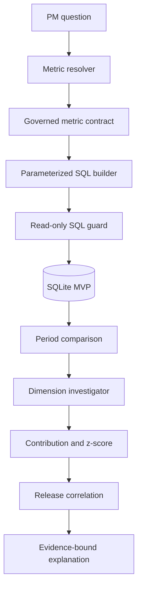

# Architecture

## System flow

## Design decisions

### Governed metrics before natural-language SQL

The question resolver may select only a version-controlled metric. Numerators, denominators, and windows are code-owned contracts. This prevents two people asking about “activation” from receiving different definitions.

### Deterministic engine before LLM narration

SQL, numerical results, contributor ranking, and release context are computed without an LLM. A future narrator may rewrite those facts, but it must not create new claims, execute queries, or alter numerical evidence.

### SQLite as the zero-dependency baseline

SQLite ships with Python and is sufficient for the synthetic MVP. The database boundary is small enough to replace with DuckDB for local columnar analysis or a read-only warehouse adapter. Those adapters should preserve the SQL guard, metric registry, query bounds, and audit trace.

### Ranked association, not causal attribution

The engine ranks dimension values by rate change multiplied by current population share. A pooled two-proportion z-score communicates strength of evidence. Release timing is correlated separately. Neither is described as causal proof.

## Trust boundaries

- Only governed metric names are resolved from natural-language questions.
- SQL identifiers come from a fixed dimension allowlist.
- Values are bound parameters.
- Only one `SELECT` or `WITH` statement is accepted.
- Mutating keywords, SQL comments, and non-allowlisted tables are rejected.
- SQLite connections execute analysis in query-only mode.
- Results are bounded to 1,000 rows per query.

## Scale path

1. Keep the core investigator database-agnostic.
2. Add DuckDB for Parquet and larger local extracts.
3. Add warehouse-specific, read-only adapters and dry-run cost checks.
4. Run investigations asynchronously with query budgets and cancellation.
5. Store question, metric version, generated SQL hash, parameters, results, and explanation as an audit record.
6. Add semantic parsing only after a benchmark demonstrates safe metric and time-window resolution.
